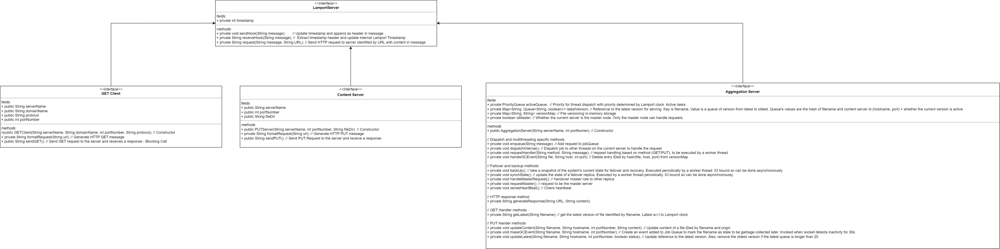

## Assumptions:

- No packet loss or packet resend logic is handled by the lower layer. 
- Event timestamp is determined at arrival at the aggregation server. For instance, if a GET and a PUT are made by a client and a content server at the same time, the response to GET depends on whether the GET request arrives before the PUT request. 

## Structure: 

The structure of the servers are described as follows: 

The components of GET client and PUT server are relatively straightforward. I will elaborate and hope to get feedback for the agg server design.

## Agg Server request handling: 

