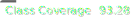

[](https://github.com/haryle/Java_Server/actions/workflows/ci.yaml)




## Github repo:
I have noticed that Grades-cope might have truncated files submitted directly from `github`, so if you cannot run the 
program, please pull the latest version from this repository: 

https://github.com/haryle/Java_Server

```bash
git pull https://github.com/haryle/Java_Server.git
```
## Quick Links:

- [How To Run The Program](doc/HowToRun.md)
- [Design](doc/SystemDesign.md)
- [Test Design](doc/Testing.md)

## Assessment Checklist:

- [x] Text sending works 
- [x] Client, server, content server start up and communicate 
- [x] PUT works 
- [x] GET works many read clients 
- [x] Aggregation expunges expired data 
- [x] Retry on errors 
- [x] Lamport Clock Implemented 
- [x] Error codes implemented 
- [x] Aggregation Server replicated and Fault Tolerant
- [x] Json parsing